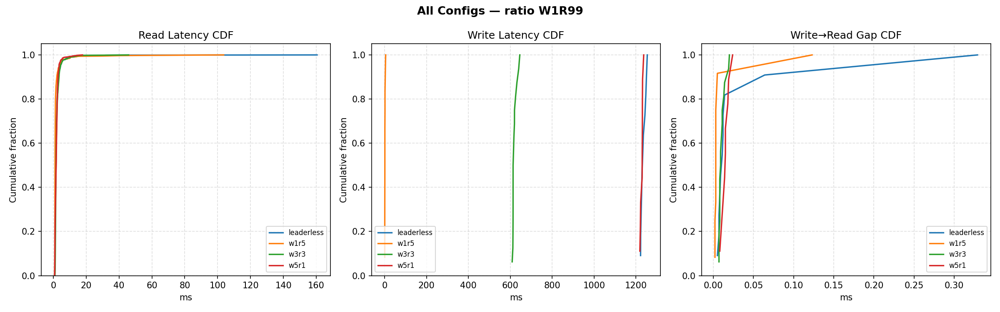
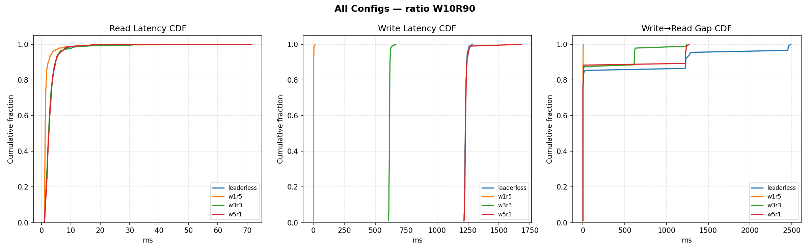
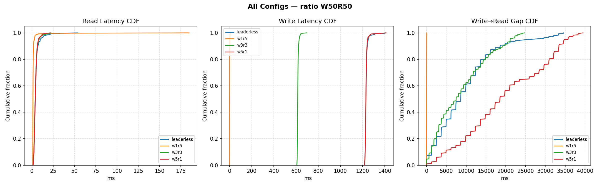
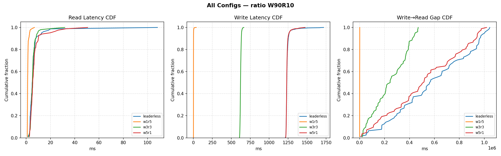

# CS 6650 — Homework 10: Distributed Key-Value Databases

---

## 1. Load Test Design

The tester maintains a pool of 100 keys. After every write to key K, it pushes K onto a paired-reads queue; the next read pops that queue and reads the same key from a random follower. This guarantees every write is immediately followed by a follower read of the exact same key, with the write→read gap recorded precisely.

Staleness is detected by comparing the version returned by the follower against the version the server reported at write time. A 404 for a key that was just written also counts as stale. Reads always go to follower ports (8002–8005) or non-coordinator ports (8012–8015), never to the leader, so the leader's quorum-read logic never masks follower staleness.

---

## 2. Delay Model

The assignment requires artificial delays to widen the consistency window:

| Event | Delay |
|-------|-------|
| Leader sleep after each follower push | 200 ms |
| Follower sleep on receiving update | 100 ms |
| Follower sleep on internal read (quorum path) | 50 ms |

This gives a hard write latency floor for each configuration:

| Config | Synchronous hops | Write latency floor |
|--------|-----------------|-------------------|
| W=5 R=1 | 4 followers × 300 ms | **~1,200 ms** |
| W=3 R=3 | 2 followers × 300 ms | **~600 ms** |
| W=1 R=5 | 0 (leader-local only) | **~2 ms** |
| Leaderless W=N | 4 peers × 300 ms | **~1,200 ms** |

Every write latency histogram in the results is a sharp spike at these values with almost no spread, because the fixed sleeps dominate completely over network jitter.

---

## 3. Summary: Average Latency and Stale Read Rates

All 16 runs (4 configs × 4 ratios), 1,000 requests each:

<table style="width:100%; border-collapse:collapse; font-family:sans-serif; font-size:13px;">
  <thead>
    <tr style="background-color:#4a7ba7; color:white;">
      <th style="padding:10px 14px; text-align:left; font-weight:bold;">Config</th>
      <th style="padding:10px 14px; text-align:center; font-weight:bold;">Ratio</th>
      <th style="padding:10px 14px; text-align:center; font-weight:bold;">Write avg (ms)</th>
      <th style="padding:10px 14px; text-align:center; font-weight:bold;">Read avg (ms)</th>
      <th style="padding:10px 14px; text-align:center; font-weight:bold;">Stale reads</th>
      <th style="padding:10px 14px; text-align:center; font-weight:bold;">Stale %</th>
    </tr>
  </thead>
  <tbody style="color:#222;">
    <tr style="border-bottom:1px solid #ddd;">
      <td style="padding:8px 14px;">Leader-Follower W=5 R=1</td>
      <td style="padding:8px 14px; text-align:center;">1% writes / 99% reads</td>
      <td style="padding:8px 14px; text-align:center;">1228</td>
      <td style="padding:8px 14px; text-align:center;">2.0</td>
      <td style="padding:8px 14px; text-align:center;">0 / 991</td>
      <td style="padding:8px 14px; text-align:center;">0.0%</td>
    </tr>
    <tr style="border-bottom:1px solid #ddd; background-color:#f9f9f9;">
      <td style="padding:8px 14px;">Leader-Follower W=5 R=1</td>
      <td style="padding:8px 14px; text-align:center;">10% writes / 90% reads</td>
      <td style="padding:8px 14px; text-align:center;">1236</td>
      <td style="padding:8px 14px; text-align:center;">3.0</td>
      <td style="padding:8px 14px; text-align:center;">0 / 897</td>
      <td style="padding:8px 14px; text-align:center;">0.0%</td>
    </tr>
    <tr style="border-bottom:1px solid #ddd;">
      <td style="padding:8px 14px;">Leader-Follower W=5 R=1</td>
      <td style="padding:8px 14px; text-align:center;">50% writes / 50% reads</td>
      <td style="padding:8px 14px; text-align:center;">1232</td>
      <td style="padding:8px 14px; text-align:center;">4.3</td>
      <td style="padding:8px 14px; text-align:center;">0 / 488</td>
      <td style="padding:8px 14px; text-align:center;">0.0%</td>
    </tr>
    <tr style="border-bottom:1px solid #ddd; background-color:#f9f9f9;">
      <td style="padding:8px 14px;">Leader-Follower W=5 R=1</td>
      <td style="padding:8px 14px; text-align:center;">90% writes / 10% reads</td>
      <td style="padding:8px 14px; text-align:center;">1237</td>
      <td style="padding:8px 14px; text-align:center;">7.1</td>
      <td style="padding:8px 14px; text-align:center;">0 / 83</td>
      <td style="padding:8px 14px; text-align:center;">0.0%</td>
    </tr>
    <tr style="border-bottom:1px solid #ddd;">
      <td style="padding:8px 14px;">Leader-Follower W=1 R=5</td>
      <td style="padding:8px 14px; text-align:center;">1% writes / 99% reads</td>
      <td style="padding:8px 14px; text-align:center;">2</td>
      <td style="padding:8px 14px; text-align:center;">1.8</td>
      <td style="padding:8px 14px; text-align:center;">18 / 988</td>
      <td style="padding:8px 14px; text-align:center;">1.8%</td>
    </tr>
    <tr style="border-bottom:1px solid #ddd; background-color:#f9f9f9;">
      <td style="padding:8px 14px;">Leader-Follower W=1 R=5</td>
      <td style="padding:8px 14px; text-align:center;">10% writes / 90% reads</td>
      <td style="padding:8px 14px; text-align:center;">2</td>
      <td style="padding:8px 14px; text-align:center;">1.8</td>
      <td style="padding:8px 14px; text-align:center;">131 / 906</td>
      <td style="padding:8px 14px; text-align:center; background-color:#fef3cd; font-weight:bold;">14.5%</td>
    </tr>
    <tr style="border-bottom:1px solid #ddd;">
      <td style="padding:8px 14px;">Leader-Follower W=1 R=5</td>
      <td style="padding:8px 14px; text-align:center;">50% writes / 50% reads</td>
      <td style="padding:8px 14px; text-align:center;">2</td>
      <td style="padding:8px 14px; text-align:center;">1.8</td>
      <td style="padding:8px 14px; text-align:center;">479 / 540</td>
      <td style="padding:8px 14px; text-align:center; background-color:#ffb3b3; font-weight:bold;">88.7%</td>
    </tr>
    <tr style="border-bottom:1px solid #ddd; background-color:#f9f9f9;">
      <td style="padding:8px 14px;">Leader-Follower W=1 R=5</td>
      <td style="padding:8px 14px; text-align:center;">90% writes / 10% reads</td>
      <td style="padding:8px 14px; text-align:center;">2</td>
      <td style="padding:8px 14px; text-align:center;">1.4</td>
      <td style="padding:8px 14px; text-align:center;">7 / 106</td>
      <td style="padding:8px 14px; text-align:center; background-color:#fef3cd; font-weight:bold;">6.6%</td>
    </tr>
    <tr style="border-bottom:1px solid #ddd;">
      <td style="padding:8px 14px;">Leader-Follower W=3 R=3</td>
      <td style="padding:8px 14px; text-align:center;">1% writes / 99% reads</td>
      <td style="padding:8px 14px; text-align:center;">620</td>
      <td style="padding:8px 14px; text-align:center;">2.2</td>
      <td style="padding:8px 14px; text-align:center;">9 / 984</td>
      <td style="padding:8px 14px; text-align:center;">0.9%</td>
    </tr>
    <tr style="border-bottom:1px solid #ddd; background-color:#f9f9f9;">
      <td style="padding:8px 14px;">Leader-Follower W=3 R=3</td>
      <td style="padding:8px 14px; text-align:center;">10% writes / 90% reads</td>
      <td style="padding:8px 14px; text-align:center;">616</td>
      <td style="padding:8px 14px; text-align:center;">3.0</td>
      <td style="padding:8px 14px; text-align:center;">46 / 904</td>
      <td style="padding:8px 14px; text-align:center; background-color:#fef3cd; font-weight:bold;">5.1%</td>
    </tr>
    <tr style="border-bottom:1px solid #ddd;">
      <td style="padding:8px 14px;">Leader-Follower W=3 R=3</td>
      <td style="padding:8px 14px; text-align:center;">50% writes / 50% reads</td>
      <td style="padding:8px 14px; text-align:center;">616</td>
      <td style="padding:8px 14px; text-align:center;">4.3</td>
      <td style="padding:8px 14px; text-align:center;">9 / 509</td>
      <td style="padding:8px 14px; text-align:center;">1.8%</td>
    </tr>
    <tr style="border-bottom:1px solid #ddd; background-color:#f9f9f9;">
      <td style="padding:8px 14px;">Leader-Follower W=3 R=3</td>
      <td style="padding:8px 14px; text-align:center;">90% writes / 10% reads</td>
      <td style="padding:8px 14px; text-align:center;">623</td>
      <td style="padding:8px 14px; text-align:center;">5.7</td>
      <td style="padding:8px 14px; text-align:center;">0 / 104</td>
      <td style="padding:8px 14px; text-align:center;">0.0%</td>
    </tr>
    <tr style="border-bottom:1px solid #ddd;">
      <td style="padding:8px 14px;">Leaderless W=N=5 R=1</td>
      <td style="padding:8px 14px; text-align:center;">1% writes / 99% reads</td>
      <td style="padding:8px 14px; text-align:center;">1235</td>
      <td style="padding:8px 14px; text-align:center;">2.2</td>
      <td style="padding:8px 14px; text-align:center;">0 / 989</td>
      <td style="padding:8px 14px; text-align:center;">0.0%</td>
    </tr>
    <tr style="border-bottom:1px solid #ddd; background-color:#f9f9f9;">
      <td style="padding:8px 14px;">Leaderless W=N=5 R=1</td>
      <td style="padding:8px 14px; text-align:center;">10% writes / 90% reads</td>
      <td style="padding:8px 14px; text-align:center;">1230</td>
      <td style="padding:8px 14px; text-align:center;">3.0</td>
      <td style="padding:8px 14px; text-align:center;">0 / 911</td>
      <td style="padding:8px 14px; text-align:center;">0.0%</td>
    </tr>
    <tr style="border-bottom:1px solid #ddd;">
      <td style="padding:8px 14px;">Leaderless W=N=5 R=1</td>
      <td style="padding:8px 14px; text-align:center;">50% writes / 50% reads</td>
      <td style="padding:8px 14px; text-align:center;">1233</td>
      <td style="padding:8px 14px; text-align:center;">4.8</td>
      <td style="padding:8px 14px; text-align:center;">0 / 521</td>
      <td style="padding:8px 14px; text-align:center;">0.0%</td>
    </tr>
    <tr style="border-bottom:1px solid #ddd; background-color:#f9f9f9;">
      <td style="padding:8px 14px;">Leaderless W=N=5 R=1</td>
      <td style="padding:8px 14px; text-align:center;">90% writes / 10% reads</td>
      <td style="padding:8px 14px; text-align:center;">1239</td>
      <td style="padding:8px 14px; text-align:center;">7.0</td>
      <td style="padding:8px 14px; text-align:center;">0 / 78</td>
      <td style="padding:8px 14px; text-align:center;">0.0%</td>
    </tr>
  </tbody>
</table>

Three patterns stand out immediately:

**Write latency is entirely determined by W, not by the workload ratio.** W=5 and Leaderless hold at ~1,230 ms across all four ratios; W=3 holds at ~616 ms; W=1 holds at ~2 ms. The ratio shifts *how often* that cost is paid, not what it is.

**Read latency grows slightly as writes increase.** For example, W=5 R=1 reads go from 2.0 ms at 1% writes to 7.1 ms at 90% writes. This is not a consistency effect — it is contention on the leader's in-memory store under heavier concurrent write lock acquisition.

**Stale reads in W=1 R=5 are non-monotonic with write percentage.** Staleness peaks at **88.7% at 50/50** — not at 90% writes, where it drops back to 6.6%. The reason: staleness depends on whether a paired read arrives *within* the ~1,200 ms propagation window. At 90% writes, reads are so rare that most land long after propagation has completed. At 50/50, writes arrive every ~2 ms and propagation can never keep up, so nearly every paired read hits a stale follower.

---

## 4. Results by Read/Write Ratio

### W=1% R=99% — Read-Dominated

**Winner: W=5 R=1 or Leaderless**

At 99% reads, write latency is nearly irrelevant — it is paid on only 10 out of 1,000 requests. W=5 R=1 and Leaderless both deliver ~2 ms reads with 0% stale reads. Their read path is a pure local hash-table lookup with no coordination. W=1 R=5 also gives ~2 ms reads with only 1.8% staleness, which is acceptable here because writes are so infrequent that the 1,200 ms async propagation almost always completes before the next read of the same key.

**Key insight:** The right metric at this ratio is read latency and correctness, not write throughput. W=5 R=1 is ideal: reads are instant, consistency is perfect, and the slow write path is rarely exercised.

---

### W=10% R=90% — Mostly Reads

**Winner: W=3 R=3**

W=5 R=1 still gives 0% staleness, but now 100 out of 1,000 requests each cost ~1,200 ms. W=3 R=3 cuts write cost exactly in half (600 ms, because only 2 of 4 followers are contacted synchronously) and keeps staleness at 5.1%. W=1 R=5 shows 14.5% staleness — paired reads fire at t≈2 ms after the write ACK, but propagation takes ~1,200 ms, so many reads land inside the consistency window.

**Key insight:** W+R = 6 > N = 5 for both W=5 and W=3. Both guarantee quorum overlap, meaning the leader's read path always returns the freshest value. The 5.1% residual staleness in W=3 R=3 comes from the load tester reading follower ports directly, not through the leader's quorum path — the 2 followers outside the write quorum may not yet have the update.

---

### W=50% R=50% — Balanced

**Winner: W=3 R=3, clearly**

At 50% writes, write latency is paid on every other request — it directly controls throughput. W=5 R=1 and Leaderless are punishing: 500 requests each cost ~1,200 ms. W=1 R=5 has 88.7% stale reads. Why so high? Writes complete at t≈2 ms (leader-local), but async propagation to all 4 followers takes ~1,200 ms. With writes arriving every ~2 ms, hundreds of keys are simultaneously in the propagation window. Almost every paired read arrives at a stale follower.

W=3 R=3 is the only configuration that balances both sides: writes cost ~620 ms (half of W=5) and staleness is ~1.8%. The quorum overlap keeps consistency strong while halving the write penalty.

**Key insight:** The 88.7% staleness at 50/50 is not a bug — it is the consistency window made visible. W=1 R=5 is explicitly an eventual consistency design, and at this ratio eventual consistency means "almost never consistent."

---

### W=90% R=10% — Write-Dominated

**Winner: W=1 R=5**

With 90% writes, write latency *is* total throughput. W=5 and Leaderless spend 900 × 1,200 ms = 1,080 seconds just in write waits for a 1,000-request run. W=1 R=5 spends 900 × 2 ms = 1.8 seconds. Staleness drops to 6.6% despite more writes — this is a probabilistic effect: reads are so rare that they mostly land on keys whose 1,200 ms propagation window has already closed.

W=3 R=3 is a middle ground: 900 × 620 ms = 558 seconds, much better than W=5 but still far from W=1 R=5's 1.8 seconds.

**Key insight:** At extreme write ratios, the 600× difference in write latency between W=1 and W=5 dominates everything. Consistency guarantees become irrelevant if the system cannot keep up with the write load.

---

## 5. Which Database for Which Application?

| Config | Best for | Why |
|--------|----------|-----|
| **W=5 R=1** | Banking, medical records, inventory | Writes are rare; correctness is non-negotiable; 0% stale reads always |
| **W=1 R=5** | IoT ingestion, social feeds, logging | Millions of writes per second; brief staleness tolerable; never use where users read back what they just wrote |
| **W=3 R=3** | Shopping cart, sessions, general-purpose APIs | Balanced: quorum overlap guarantees consistency, write cost is half of W=5 |
| **Leaderless W=N** | Distributed config, geo-distributed writes | No single-leader bottleneck; any node coordinates writes; trade-off: all N nodes must be up for any write to succeed |
