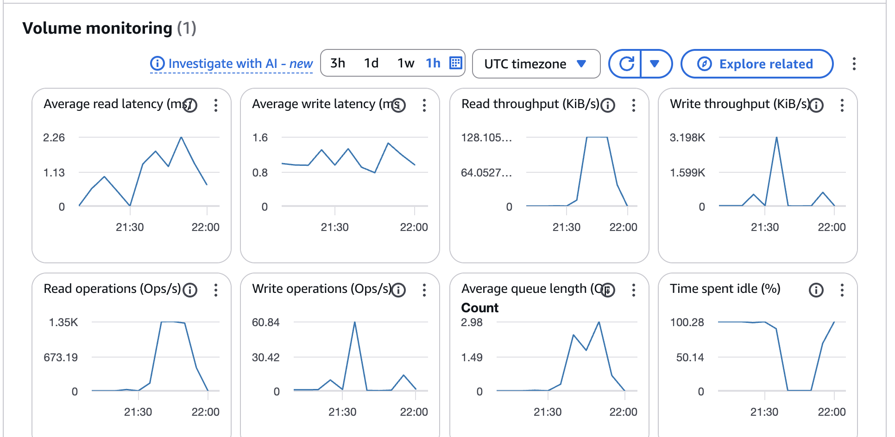

## 1. papaer review - share my thought about the papaer
## 2. Part2:
### 2.1 explain ` main.tf` code
### 2.2 show to process:
Terminal Commands:
+ AWS
    + aws configure
    + aws configure set aws_session_token + token
    + aws sts get-caller-identity
+ Create Instance
    + terraform init
    + terraform apply -auto-approve
+ Connect via SSH
    + ssh -i "YumengZeng-cs6650-hw1b.pem" ec2-user@ec2-34-215-204-171.us-west-2.compute.amazonaws.com

## 3. Part3: Docker 
### 3.1 Build and run image in local
+ explain Dockerfile
+ create a new terminal in the current folder (hw2) & run commands
    + docker build --tag godocker2 .
    + docker image ls
    + docker run -d -p 8080:8080 --name my-app godocker2
    + docker ps
### 3.2 Build and run image in the Cloud
+ create a new EC2 instance
+ then, install Git and Docker
    + sudo yum update -y
    + sudo yum install git -y
    + sudo yum install docker -y
    + sudo service docker start
    + sudo usermod -a -G docker ec2-user
    + then, exit (disconnect ssh) and reconnect
    + git clone https://github.com/lemonzeng/cs6650-distributed-systems.git
    + cd cs6650-distributed-systems/hw2
+ [!Important] Build docker in the instance
+ be careful! It would OOM.
+ 为什么你的项目必须开启 Swap？
硬件瓶颈：你使用的 AWS t2.micro 或 t3.micro 实例通常只有 1GB 内存。

Go 编译器的特性：go build 命令在编译程序时是一个“内存大户”。它需要将所有的依赖包、抽象语法树（AST）和符号表加载到内存中进行分析和优化。

之前的崩溃原因：当你运行 docker build 时，Docker 引擎本身占用一部分内存，Go 编译又在抢占剩余内存。一旦总需求超过 1GB，Linux 内核的 OOM Killer (Out of Memory Killer) 机制就会启动，为了保住系统不崩溃，它会随机杀掉进程。

现象：这就是为什么你刚才会发现 SSH 连接断开或者终端完全没反应——系统为了腾出空间把你的连接进程给关了。
Swap 的原理是什么？
Swap（交换空间） 的本质是把硬盘当成临时内存来用。

虚拟内存 (Virtual Memory)：操作系统会给程序造成一种“内存很大”的假象。它把物理内存（RAM）和硬盘上的一块空间（Swapfile）组合在一起，形成一个巨大的虚拟内存池。

换入换出 (Paging/Swapping)：

当物理内存快满时，Linux 内核会寻找那些“目前虽然占着位置，但还没被用到”的数据，把它们搬到硬盘上的 Swapfile 里。

这样就腾出了宝贵的物理内存给正在拼命工作的 go build 进程。

当需要用回那些被搬走的数据时，系统再把它们从硬盘读回内存。

总结
优点：充当了“安全气囊”。它能防止你的 EC2 实例因为内存瞬间爆表而导致系统死机。

缺点：硬盘的读写速度比物理内存慢几百倍。所以开启 Swap 后，你会发现 docker build 跑得比本地 Mac 慢很多，但它至少能跑完而不会让服务器断线。

在 Canvas 的指南中，我建议你开启 2GB 的 Swap，这样你的可用内存就从 1GB 变成了 1+2=3GB，足以应对 HW2 的构建任务。
+ 建立“防线” —— 开启 Swap (极其重要)

这是防止再次死机的唯一方法。 登录成功后，请立刻依次执行这 5 行命令：

#### 1. 创建 2GB 的交换文件 (硬盘借给内存)
sudo dd if=/dev/zero of=/swapfile bs=128M count=16
#### 2. 修改权限
sudo chmod 600 /swapfile
#### 3. 格式化
sudo mkswap /swapfile
#### 4. 启用
sudo swapon /swapfile
#### 5. 确认 (Swap 一行应该显示 2.0G 左右)
free -h
#### 5. build image
docker build -t godocker2 .
#### 6. run image
docker run -d -p 8080:8080 --name godocker2 godocker2
#### 7. test it by get request
curl http://Public IPv4 address:8080/albums

+ 总结
1. 为什么 EC2 实例不需要安装 Go 就能运行程序？

核心原理：自包含性 (Self-containment)

打包运行时环境：当你执行 docker build 时，Docker 根据 Dockerfile 中的 FROM golang:1.21-alpine 指令，已经将 Go 的运行时环境（甚至是一个精简版的 Linux 操作系统）打包进了镜像。

静态二进制文件：在构建过程中，代码被编译成了静态链接的二进制可执行文件。

宿主机角色变化：在容器化时代，EC2 宿主机（Host）的角色从“执行环境”变成了“资源提供者”。它只需要安装 Docker Engine，这个引擎负责读取镜像并分配 CPU/内存资源，而不需要关心镜像内部使用的是 Go、Python 还是 Java。

2. 深入浅出 Dockerfile：每一行都在做什么？

假设你的 Dockerfile 如下，我们可以这样“Walk through”：

FROM golang:1.21-alpine：

解释：选择基础镜像。alpine 是极简版的 Linux，能显著缩小镜像体积（从几百 MB 降到几十 MB）。

WORKDIR /app：

解释：在容器内部创建并进入 /app 目录。后续所有命令都在这里执行，保持路径整洁。

COPY go.mod go.sum* ./ 和 RUN go mod download：

解释：先拷贝依赖描述文件并下载。这是 缓存优化：如果代码改了但依赖没变，Docker 会跳过下载步骤，极大缩短后续 Build 时间。

COPY *.go ./：

解释：将本地编写的源码拷贝进容器。

RUN go build -o /godocker：

解释：在容器环境内编译代码，生成名为 godocker 的二进制文件。

EXPOSE 8080：

解释：文档化声明。告诉外部：“这个集装箱有一个在 8080 端口的窗口”。

CMD [ "/godocker" ]：

解释：启动指令。当容器启动时，执行这个编译好的二进制程序。

3. 使用容器的优缺点 (Pros & Cons)

优点 (Pros)：

一致性 (Consistency)：彻底解决 "It works on my machine" 的问题。本地测通了，云端一定能跑。

隔离性 (Isolation)：不同应用运行在各自的“盒子”里，互不干扰，安全性更高。

快速扩展 (Scalability)：镜像非常轻量，可以在几秒内启动数百个实例。

缺点 (Cons)：

性能损耗 (Performance Overhead)：虚拟化网络和文件系统会带来极轻微的性能开销。

学习曲线 (Complexity)：引入了额外的构建流程和镜像管理工作。

4. 直接在 EC2 运行 vs. 在容器内运行

直接运行：就像在房子里直接摆家具。如果你想换个房子，你得重新量尺寸、重新刷墙、重新搬家。

容器运行：就像把家具装进集装箱，然后把集装箱吊进房子。换房子时，直接吊起集装箱放到新房子即可，里面的布置完全不用动。

5. 机器坏了怎么办？AMI vs. Docker Image

如果你手动安装的 Docker 和 Git 随着机器损坏丢失了，你会发现只靠 Docker Image 是不够的。

Docker Image (家具)：打包的是应用逻辑。它不负责安装 Docker 引擎本身。

AMI (房子的蓝图)：它是 Amazon Machine Image，是整个操作系统的快照。

解决方案：你可以创建一个预装了 Docker、Git 和 Swap 配置的 AMI。

区别：

AMI 是为了“快速复刻服务器硬件环境”。

Docker Image 是为了“快速部署业务代码”。

最佳实践：用 Terraform 调用你自定义的 AMI 启动 EC2，然后 EC2 自动从 GitHub 拉取代码并运行 Docker。这才是真正的自动化生产流程。
### 3.3 create a new instance and repeat building image
## Part 4: test inconsistency
+ activate vitual environment: source venv/bin/activate
+ python3 test_consistency.py
