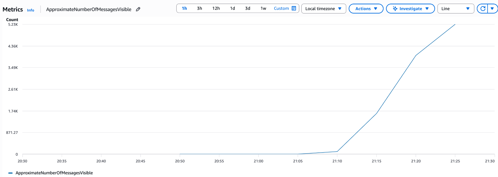
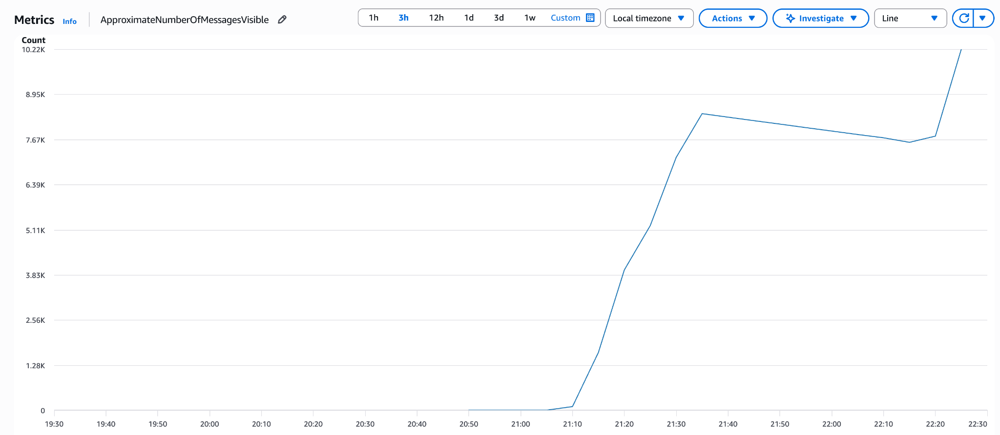
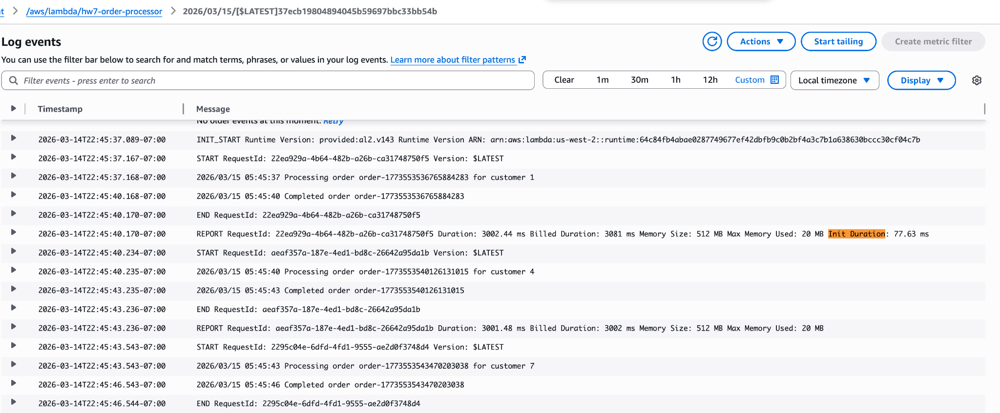

# HW7: When Your Startup's Flash Sale Almost Failed
**Author:** Yumeng Zeng (zeng.yum@northeastern.edu)
**Course:** CS6650 — Building Scalable Distributed Systems
**Date:** March 2026

---

## Part II: The Simulated Problem — SQS + Async Processing

### Infrastructure

All infrastructure provisioned via Terraform (code in `terraform/`):

| Resource | Configuration |
|---|---|
| VPC | 10.0.0.0/16 |
| Public Subnets (ALB) | 10.0.1.0/24, 10.0.2.0/24 |
| Private Subnets (ECS) | 10.0.10.0/24, 10.0.11.0/24 |
| ECS Fargate | 256 CPU / 512MB RAM per task |
| SNS Topic | `order-processing-events` |
| SQS Queue | `order-processing-queue` (visibility timeout: 30s, retention: 4 days, long polling: 20s) |
| ALB | `http://hw7-alb-488235362.us-west-2.elb.amazonaws.com` |

### Application Architecture

Two Go services deployed as separate ECS tasks:

**order-receiver** — handles incoming HTTP requests
- `GET /health` → 200 OK
- `POST /orders/sync` → acquires buffered channel semaphore (capacity 5), sleeps 3s, returns 200
- `POST /orders/async` → publishes to SNS, returns 202 immediately

**order-processor** — polls SQS continuously
- Long-polls SQS (WaitTimeSeconds=20, up to 10 messages/batch)
- Goroutine semaphore controls concurrency (`WORKER_COUNT` env var)
- Deletes message after successful processing

> **Note on bottleneck simulation:** A plain `time.Sleep(3s)` in Go does not block an OS thread (M:N scheduling). To faithfully simulate payment processor saturation, a buffered channel semaphore gates concurrent access — `paymentSlots <- struct{}{}` blocks when capacity is full, enforcing real throughput limits.

---

### Phase 1: Normal Operations — Sync Endpoint

**Test config:** 5 users, spawn rate 1/sec, 30 seconds, `SyncOrderUser`

| Metric | Value |
|---|---|
| Total requests | 38 |
| Failures | 0 (0%) |
| Avg response time | 3,066ms |
| Min / Max | 3,037ms / 3,144ms |
| Throughput | 1.34 req/sec |

**Result:** ✅ 100% success rate. All requests complete in ~3s as expected.

---

### Phase 2: Flash Sale — Sync Endpoint Bottleneck

**Test config:** 20 users, spawn rate 10/sec, 60 seconds, `SyncOrderUser`

| Metric | Value |
|---|---|
| Total requests | 95 |
| Failures | 0 (0%) |
| Avg response time | **10,746ms** |
| Median response time | **12,000ms** |
| Throughput | 1.66 req/sec |

**Bottleneck analysis:**

| | Value |
|---|---|
| Payment processor speed | 1 order / 3 seconds |
| Max concurrent slots | 5 |
| Maximum throughput | 5 ÷ 3 = **1.67 orders/sec** |
| Flash sale demand | **~57 orders/sec** |
| Orders unable to be served per second | **~55.4/sec** |

**The harsh reality:** Customers waited 4–12 seconds per request. With a real production timeout of 5–10 seconds, over 55 orders/second would be dropped entirely. The semaphore queue fills instantly — the system is 34x undersized for flash sale load.

---

### Phase 3: The Async Solution

**Test config:** 20 users, spawn rate 10/sec, 60 seconds, `AsyncOrderUser`

| Metric | Value |
|---|---|
| Total requests | 1,550+ |
| Failures | **0 (0%)** |
| Avg response time | **53ms** |
| Throughput | **57 req/sec** |

**Comparison:**

| | Sync | Async |
|---|---|---|
| Orders accepted (60s) | 95 | 1,550 |
| Acceptance rate | 1.66/sec | 57/sec |
| Avg response time | 10,746ms | **53ms** |
| Failure rate | 0%* | 0% |
| Customer experience | Waiting 10–12s | Returns in 53ms |

*No failures because Locust timeout was 30s; in production customers would timeout and abandon.

**Async accepted ~16x more orders** than sync in the same time window, with **202x faster** response times.

---

### Phase 4: The Queue Problem

With 1 worker goroutine processing at 0.33 orders/sec and the system accepting 57 orders/sec:

| Metric | Value |
|---|---|
| Order acceptance rate | ~57/sec |
| Single worker processing rate | 1 ÷ 3 = **0.33/sec** |
| Queue growth rate | **~56.7 messages/sec** |
| Peak queue depth observed | **~5,225 messages** |
| Estimated time to drain | 5,225 ÷ 0.33 = **~261 minutes** |

**CloudWatch SQS — Queue Spike (1 worker):**

> Screenshot: `ApproximateNumberOfMessagesVisible` — queue builds from 0 to 5,225+ during the 60-second flash sale (21:08–21:28), with no meaningful drain visible over the subsequent 15+ minutes.



*Customer service is getting calls: "Where's my order confirmation?"*

---

### Phase 5: Scaling Workers

**Test:** Same flash sale (20 users, 57 req/sec, 60s) repeated at each worker count.
**CloudWatch metric:** `ApproximateNumberOfMessagesVisible` on `order-processing-queue`

| Workers | Theoretical Throughput | Peak Queue Depth | Estimated Drain Time | CPU Util | Memory Util |
|---------|----------------------|-----------------|---------------------|----------|-------------|
| **1** | 0.33/sec | ~5,225 | ~261 min | ~0% | ~1.5% |
| **5** | 1.67/sec | ~10,204 | ~102 min | ~0% | ~1.6% |
| **20** | 6.67/sec | ~12,728 | ~31 min | ~0% | ~1.7% |
| **100** | 33.3/sec | ~7,523 | **~2 min (measured)** | ~12.7% | ~1.7% |

**CloudWatch SQS — All Phases Overview:**

> Screenshot: Full 3-hour view showing queue accumulation across all tests. First peak ~8.9K (1-worker phase), partial drain, then second spike to ~10.2K (5/20-worker tests). With 100 workers the queue visibly drained from 7,523 → 161 in approximately 2 minutes.



**Finding the balance:**

To fully prevent queue buildup at 57 orders/sec:
- Required workers = 57 × 3 = **~171 goroutines**
- At 100 workers (33.3/sec), existing backlog drained in ~2 minutes — dramatically better than 1 worker but still trailing real-time ingestion
- **~180 workers** is the minimum to keep pace with the flash sale load in real time
- CPU only hit 12.7% at 100 workers — the bottleneck is I/O (network + sleep), not compute

---

### Analysis Questions

**1. How many times more orders did async accept vs sync?**

Async accepted **~16x more orders** (1,550 vs 95) in the same 60-second window, at **202x lower latency** (53ms vs 10,746ms). The fundamental difference: sync ties up a connection and a payment slot for the full 3 seconds; async acknowledges the order in <100ms and defers processing to background workers.

**2. What causes queue buildup and how do you prevent it?**

Queue buildup occurs when the **ingestion rate exceeds the processing rate**. At 57 orders/sec with 3s/order, you need 171 concurrent workers minimum. Prevention strategies:
- **Static scaling:** Pre-provision enough workers for expected peak (171+ goroutines)
- **Auto-scaling:** Use CloudWatch `ApproximateNumberOfMessagesVisible` alarm to trigger ECS task scaling when queue depth exceeds a threshold
- **Lambda:** AWS auto-scales Lambda concurrency automatically — no manual worker management needed

**3. When would you choose sync vs async in production?**

| Use **Sync** when | Use **Async** when |
|---|---|
| Client needs immediate result (inventory check, fraud score) | Processing takes seconds+ (payment, fulfillment, email) |
| Latency SLA < 500ms | Client can tolerate eventual completion |
| Operation is fast and predictable | Need to absorb traffic spikes without dropping requests |
| Simplicity matters more than scale | Processing failures should be retried silently |

---

## Part III: What If You Didn't Need Queues? — Lambda

### Architecture Change

```
Before (Part II):  Order API → SNS → SQS → ECS Workers (you manage everything)
After  (Part III): Order API → SNS → Lambda           (AWS manages everything)
```

### Deployment

- **Runtime:** `provided.al2` (Go binary compiled as `bootstrap`)
- **Memory:** 512MB
- **Timeout:** 10 seconds
- **Trigger:** SNS topic `order-processing-events` (direct subscription, no SQS)
- **Processing:** Same 3-second payment simulation

### Cold Start Observations

Sent 10 orders through the existing `/orders/async` endpoint and observed CloudWatch logs:

```
INIT_START Runtime Version: provided:al2.v143

REPORT RequestId: 22ea929a  Duration: 3002.44ms  Billed: 3081ms
  Memory: 512MB  Max Memory Used: 20MB  Init Duration: 77.63ms   ← COLD START

REPORT RequestId: aeaf357a  Duration: 3001.48ms  Billed: 3002ms
  Memory: 512MB  Max Memory Used: 20MB                           ← WARM

REPORT RequestId: 2295c04e  Duration: 3001.48ms  Billed: 3002ms  ← WARM
REPORT RequestId: b121af95  Duration: 3001.52ms  Billed: 3002ms  ← WARM
```



**Cold start analysis:**

| Metric | Value |
|---|---|
| Cold start init time | **77.63ms** |
| Warm execution time | ~3,001ms |
| Cold start overhead | 77.63 / 3002.44 = **~2.6%** |
| Memory allocated | 512MB |
| Memory actually used | **20MB** (only 3.9% of allocation) |
| Cold starts occur | First invocation only (or after ~5+ min idle) |

**Does cold start matter?** For 3-second payment processing, a 77ms cold start is **negligible** (2.6% overhead). It would matter for latency-sensitive workloads under 100ms, but not here.

### Cost Reality Check

| | ECS Workers | Lambda |
|---|---|---|
| Fixed monthly cost | **~$17/month** (2 tasks, always running) | **$0** (pay per invocation) |
| 10K orders/month | $17 | $0 (free tier) |
| 100K orders/month | $17 | $0 (free tier) |
| 267K orders/month | $17 | ~$0 (hitting free tier limit) |
| 1.7M orders/month | $17 | ~$17 (break-even) |
| Operational burden | Queue monitoring, worker tuning, ECS health | **Zero** |

Lambda stays **free until ~267K orders/month** and only matches ECS cost at ~1.7M orders/month.

### Should Your Startup Switch to Lambda?

**Yes.** For a startup processing under 267K orders/month, Lambda is the clear winner. The 2.6% cold start overhead is negligible on 3-second payment processing. Lambda eliminates the entire operational layer — no SQS queue monitoring at 3am, no manual worker scaling, no ECS health check tuning, no visibility timeout adjustments. The cost is literally $0 within the free tier.

The trade-off: Lambda loses SQS's durability guarantees. SNS retries a Lambda failure only twice before discarding the message, whereas SQS supports configurable retries and dead-letter queues. For a startup, this is acceptable — if an order is lost, the customer will retry. When the business scales past 267K orders/month and payment reliability becomes paramount, the right move is to reintroduce SQS between SNS and Lambda at that point, adding durability without sacrificing serverless simplicity.

---

## Contributions

This report covers my individual implementation and experiments. Results were compared and contrasted with teammates in the shared group report.

- **Yumeng Zeng:** Full implementation (Go services, Terraform, Locust), all load tests, CloudWatch metrics collection, Lambda deployment and cold start analysis.
