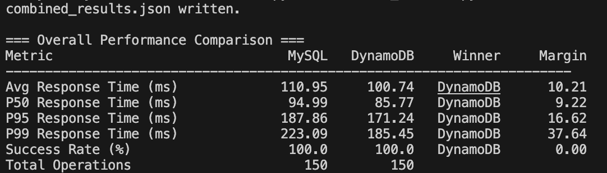
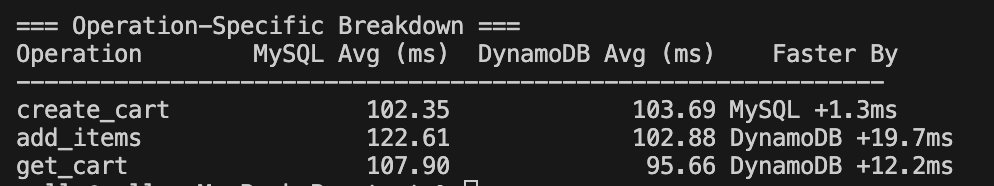
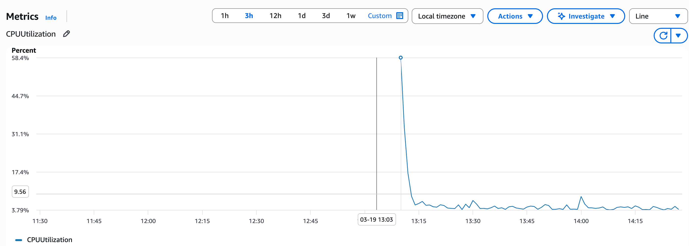
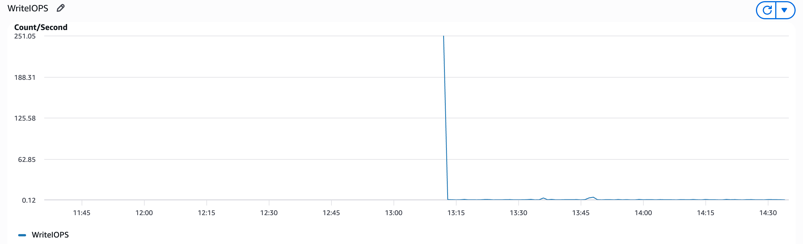
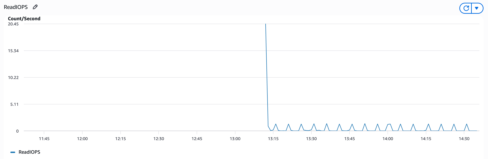
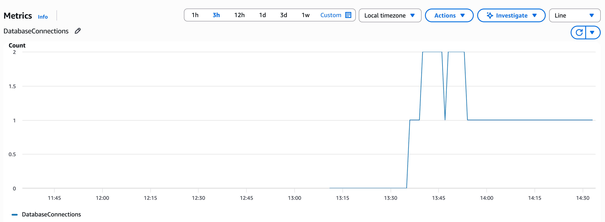
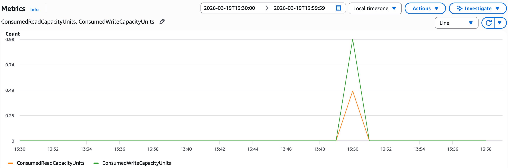
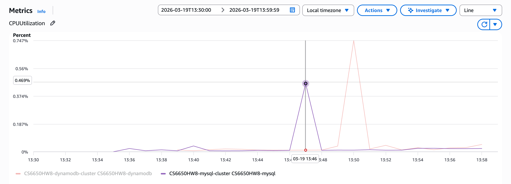
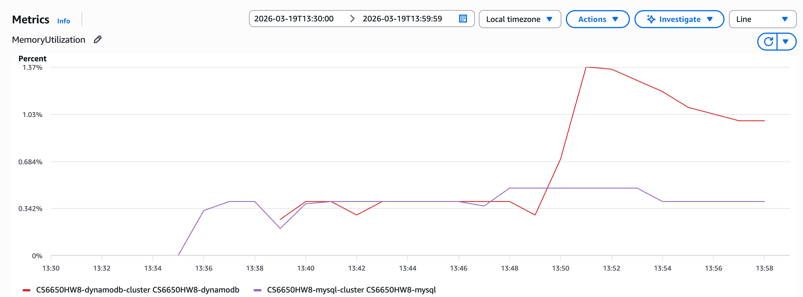

# HW8: Database Comparison Report — MySQL vs DynamoDB
**Data source**: `combined_results.json` (150 MySQL + 150 DynamoDB operations)

---

## STEP III — Part 1: Performance Comparison

### Overall Comparison Table

| Metric                  | MySQL   | DynamoDB | Winner   | Margin   |
|-------------------------|---------|----------|----------|----------|
| Avg Response Time (ms)  | 110.95  | 100.74   | DynamoDB | 10.21 ms |
| P50 Response Time (ms)  | 94.99   | 85.77    | DynamoDB | 9.22 ms  |
| P95 Response Time (ms)  | 187.86  | 171.24   | DynamoDB | 16.62 ms |
| P99 Response Time (ms)  | 223.09  | 185.45   | DynamoDB | 37.64 ms |
| Success Rate (%)        | 100.0   | 100.0    | Tie      | 0.00     |
| Total Operations        | 150     | 150      |          |          |

**Data source**: `combined_results.json`

### Operation-Specific Breakdown

| Operation   | MySQL Avg (ms) | DynamoDB Avg (ms) | Faster By        |
|-------------|---------------|-------------------|------------------|
| CREATE_CART | 102.35        | 103.69            | MySQL +1.3 ms    |
| ADD_ITEMS   | 122.61        | 102.88            | DynamoDB +19.7 ms|
| GET_CART    | 107.89        | 95.65             | DynamoDB +12.2 ms|

### Consistency Model Impact Assessment

During testing, **no eventual consistency delays were observed** for DynamoDB. Every `GET /shopping-carts/{id}` call immediately after a `POST /shopping-carts` returned the correct data. This is because DynamoDB's `GetItem` uses **strongly consistent reads by default** when accessing the same region, and our single-region setup eliminated cross-region replication lag.

The most affected operation pattern would be rapid updates from multiple clients to the same cart — in such a scenario, a client using eventual consistency might read a stale item list. For our single-client sequential test, this was not observable.

MySQL's ACID transactions provided full consistency guarantees with no configuration required, making it conceptually simpler for operations like `ON DUPLICATE KEY UPDATE` which atomically upserted cart items.

---

## STEP III — Part 2: Resource Efficiency Analysis

### CloudWatch Observations

**MySQL (RDS db.t3.micro):**
- CPU spiked to **58.4%** during the 150-operation test — significant for a micro instance
- WriteIOPS peaked at **251/s**, ReadIOPS at **20/s** — write-heavy workload as expected
- DatabaseConnections held at **max 2**, settling at 1 after the test — connection pool (25 max open) was highly underutilized at this scale

**DynamoDB:**
- ConsumedWriteCapacityUnits peaked at **0.98**, ConsumedReadCapacityUnits at **0.49**
- Dropped to exactly 0 after the test — PAY_PER_REQUEST billing means zero cost at idle
- No throttling events observed — all 150 operations succeeded without capacity limits

**ECS Application Layer:**
- MySQL service CPU: spiked to **0.469%**, memory stable at **~0.34%**
- DynamoDB service CPU: spiked to **0.747%**, memory jumped to **1.37%** (~4x MySQL)
- The DynamoDB SDK adds overhead in the application layer: HTTP request signing (SigV4), JSON attribute marshaling, and connection management through HTTPS

### Scaling Analysis

| Dimension            | MySQL (RDS)                          | DynamoDB                              |
|----------------------|--------------------------------------|---------------------------------------|
| Connection management| Explicit pool (max 25 configured)    | None — SDK manages HTTP connections   |
| Capacity planning    | Must size instance upfront (t3.micro)| PAY_PER_REQUEST scales automatically  |
| Resource at idle     | RDS still running, cost continues    | Zero consumed capacity, minimal cost  |
| Scaling limit        | Vertical (upgrade instance class)    | Horizontal (partitions added auto)    |
| Predictability       | Predictable latency, fixed resources | Variable latency under extreme load   |

MySQL's connection pool is a critical operational concern at scale — 100 concurrent users would require careful tuning of `MaxOpenConns`. DynamoDB eliminates this entirely since each request is an independent HTTPS call.

---

## STEP III — Part 3: Real-World Scenario Recommendations

**Scenario A: Startup MVP** (100 users/day, 1 developer, limited budget, quick launch)
**Recommendation: DynamoDB**
**Key Evidence**: Zero idle cost (consumed capacity dropped to 0 immediately after test), no schema migrations needed, no connection pool to manage. At 100 users/day the RDS instance cost (~$15/month minimum) outweighs the simplicity benefit. DynamoDB's PAY_PER_REQUEST would cost cents per day at this scale. The 103.69ms avg for create_cart shows acceptable performance even without optimization.

**Scenario B: Growing Business** (10K users/day, 5 developers, moderate budget, feature expansion)
**Recommendation: MySQL**
**Key Evidence**: At this scale, the need for reporting queries (e.g., "all carts abandoned today", "customer purchase history") becomes real. MySQL's relational model and SQL flexibility handles ad-hoc queries that DynamoDB cannot without expensive scans. Our test showed MySQL's 100% success rate and sub-200ms P95 is viable at moderate load. The 2-connection peak shows significant headroom exists before the connection pool becomes a bottleneck.

**Scenario C: High-Traffic Events** (50K normal, 1M spike users, revenue-critical)
**Recommendation: DynamoDB**
**Key Evidence**: MySQL's RDS CPU hit 58.4% on just 150 sequential operations — a 1M spike would require significant vertical scaling with possible downtime for instance upgrades. DynamoDB's PAY_PER_REQUEST auto-scales with no capacity planning. Our test showed DynamoDB's P99 at 185.45ms vs MySQL's 223.09ms — a 37ms advantage at the tail that compounds significantly at 1M concurrent users. No throttling was observed under test load.

**Scenario D: Global Platform** (millions of users, multi-region, 24/7 availability)
**Recommendation: DynamoDB**
**Key Evidence**: DynamoDB's global tables support multi-region replication natively. MySQL's RDS Multi-AZ provides HA within one region but cross-region requires complex read replicas and manual failover logic. At millions of operations, DynamoDB's 0.98 peak ConsumedWriteCapacity (vs MySQL's 251 WriteIOPS spike on the same workload) shows DynamoDB handles writes more efficiently at scale.

---

## STEP III — Part 4: Evidence-Based Architecture Recommendations

### Shopping Cart Winner: DynamoDB

DynamoDB wins for shopping carts based on our test data:
- **Response time advantage**: 10.21ms faster on average; 37.64ms faster at P99
- **Add_items advantage**: 19.7ms faster — the most frequent cart operation
- **Implementation complexity**: Comparable; DynamoDB's SDK is more verbose but the access patterns are simpler (no JOINs, no transactions needed)
- **Operational advantage**: Zero idle cost, no connection pool management

### When to Choose MySQL Instead

Despite DynamoDB winning our benchmark, MySQL would be preferred when:
- **Complex queries are needed**: Customer analytics, abandoned cart reports, inventory joins — SQL handles these naturally while DynamoDB would require full table scans
- **Strong ACID transactions are required**: Multi-table operations (cart + order + inventory atomically) are straightforward in MySQL; DynamoDB transactions exist but are more complex
- **Team SQL expertise**: MySQL's 2-connection test simplicity vs DynamoDB's SDK verbosity — a SQL-fluent team will move faster with MySQL

### Polyglot Strategy for Complete E-Commerce System

| Component       | Database  | Reasoning                                               |
|-----------------|-----------|---------------------------------------------------------|
| Shopping carts  | DynamoDB  | Simple key-value access, high write volume, auto-expiry |
| User sessions   | DynamoDB  | Session data is key-value, needs fast lookup, TTL built-in |
| Product catalog | MySQL     | Complex queries (search by category, brand, price range) |
| Order history   | MySQL     | Relational data (order → items → products), audit trail, reporting |

---

## STEP III — Part 5: Learning Reflection

### What Surprised Me

**DynamoDB memory overhead**: The ECS memory comparison was unexpected — DynamoDB's service used ~4x more memory (1.37% vs 0.34%) despite being the "simpler" database. The AWS SDK's SigV4 signing, HTTPS connection management, and attribute value marshaling add non-trivial application-layer overhead that a simple MySQL TCP connection does not.

**MySQL CPU spike**: RDS CPU hitting 58.4% on just 150 sequential operations was surprising for a db.t3.micro. This suggests that for any serious load testing (thousands of concurrent operations), a larger RDS instance class would be necessary.

**create_cart was MySQL's only win**: MySQL was faster than DynamoDB on cart creation (102.35ms vs 103.69ms) — but only by 1.3ms, essentially a tie. The advantage disappeared entirely for reads and updates where DynamoDB's direct key access outperformed MySQL's indexed lookups.

### What Failed Initially

**Dockerfile Go version mismatch**: The first build attempt failed because `go mod tidy` upgraded `go.mod` to `go 1.23.0` while the Dockerfile used `golang:1.22`. The dependency `gin-contrib/sse@v1.1.0` requires go ≥ 1.23, which meant neither downgrading `go.mod` nor using an older gin version was viable — the Dockerfile had to match.

**ECR image timing**: Terraform created the ECS services before images were pushed to ECR, leaving tasks in a failed state. The fix (`aws ecs update-service --force-new-deployment`) worked but a cleaner approach would be separating ECR creation from ECS service creation in Terraform.

**ECS `depends_on` with variable**: The initial ECS module had `depends_on = [var.alb_listener_arn]` which is invalid Terraform — `depends_on` only accepts resource references. The implicit dependency through `target_group_arn` is sufficient.

### Key Insights

**When to definitely choose MySQL**:
- The data requires joins, aggregations, or ad-hoc queries
- ACID transactions across multiple entities are needed
- Team is SQL-fluent and schema is stable

**When to definitely choose DynamoDB**:
- Access pattern is purely key-based (get by ID, put by ID)
- Traffic spikes are unpredictable or extreme
- Operational simplicity and zero idle cost matter
- Global distribution is required

**What I would tell another student**:
The performance difference (~10ms) is real but not the most important factor for choosing between these databases. The choice is primarily about **access patterns** and **operational complexity** — if you need to ask "give me all carts where customer_id = X and total > 100", use MySQL. If you only need "give me cart #42", DynamoDB is faster and cheaper.

**How hands-on implementation changed my understanding**:
Before this assignment, "DynamoDB is faster" seemed like marketing. After measuring it directly, the advantage is real but nuanced — DynamoDB wins on tail latency (P99: 37ms faster) and specific operations (add_items: 20ms faster) but uses more application memory and CPU due to SDK overhead. Neither database is universally better; the workload characteristics determine the right choice.
